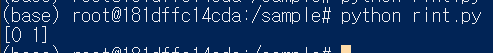

# scikit learn 학습

> 본 학습은 docker에서 진행됩니다. docker 폴더의 선행학습을 진행해주세요.

## 기본 설정

### miniconda 실행

```dockerfile
docker run -i -t -v /d/sample:/sample mlearn:init /bin/bash
```

### scikit-learn scipy matplotlib scikit-image 설치

```python
pip install -U scikit-learn scipy matplotlib scikit-image
```

-U 옵션은 최신버전이 있다면 최신버전으로 설치를 하도록 도와주는 옵션이다.

### pandas 설치

```python
pip install pandas
```

### 현재까지 설정한 이미지를 저장

```
docker ps -a
docker commit 4be77ce7c418 mlearn:init
```

docker ps -a 명령어를 사용하면 현재까지 사용한 모든 컨테이너 아이디를 확인할 수 있습니다. 현재까지의 설정을 저장할 컨테이너 id를 복사한 후 기존의 컨테이너 또는 새로운 이름으로 commit을 수행합니다.

```dockerfile
docker run -i -t -v /d/sample:/sample mlearn:init /bin/bash
```

## 예제 학습

### xor 체크 예제

```python
from sklearn import svm

clf = svm.SVC()
# clf.fit(데이터, 답)
clf.fit(
    [
        [0,0],
        [1,0],
        [0,1],
        [1,1]
    ],
    [0,1,1,0]
)
results = clf.predict([
    [0,0],
    [1,0]
])
print(results)
```

##### 5 line - fit()

데이터와 답을 설정하는 메소드입니다. 데이터와 답은 리스트형태로 입력합니다.

##### 14 line - predict()

예측이라는 뜻의 predict 리스트로 주어진 데이터를 바탕으로 fit값을 참고하여 리스트 형태로 답을 반환합니다.

#### 실행화면



### 정답률을 체크할 수 있는 코드

```python
from sklearn import svm, metrics

# xor 계산 데이터 실습

datas = [
        [0, 0],
        [1, 0],
        [0, 1],
        [1, 1]
    ]
labels = [0, 1, 1, 0]
examples = [
        [0, 0],
        [1, 0]
    ]
examples_label = [0, 1]
clf = svm.SVC()
# clf.fit(데이터, 답)
clf.fit(datas, labels)
results = clf.predict(examples)
print(results)

score = metrics.accuracy_score(examples_label, results)
print("정답률 : ", score * 100, "%")
```

##### 23 line - metrics.accuracy_score()

정답률을 확인할 수 있는 메소드입니다. 예상 정답과 출력된 정답을 매개변수로 입력시 0에서 1까지의 값이 반환됩니다.


### 붓꽃검증 

[붓꽃데이터](https://raw.githubusercontent.com/pandas-dev/pandas/master/pandas/tests/data/iris.csv)

#### pandas를 사용하여 csv파일 읽고 출력하기

```python
import pandas
from sklearn import svm, metrics

csv = pandas.read_csv("iris.csv")
data = csv[["SepalLength","SepalWidth","PetalLength","PetalWidth"]]
label = csv["Name"]

print(data)
print(label)
```


#### 임의의 붓꽃정보 입력 테스트

```python
import pandas
from sklearn import svm, metrics

csv = pandas.read_csv("iris.csv")
data = csv[["SepalLength","SepalWidth","PetalLength","PetalWidth"]]
label = csv["Name"]

clf = svm.SVC()
clf.fit(data, label)
results = clf.predict([
    [5.1, 3.0, 1.3, 0.2]
])
print(results)
# 결과 ['Iris-setosa']
```

#### 실데이터를 기반으로 모델의 정확도 검증

학습모델은 반드시 검증작업을 진행해야 한다. 때문에 실데이터를 학습데이터와 테스트데이터로 나눠 정확도를 검증한다. 학습데이터와 테스트데이터를 랜덤하게 바꿔가며 테스트를 해야 하지만 이러한 작업을 쉽게 도와주는 라이브러리 사용법을 배워보자.

```python
import pandas
from sklearn import svm, metrics
from sklearn.model_selection import train_test_split

csv = pandas.read_csv("iris.csv")
data = csv[["SepalLength","SepalWidth","PetalLength","PetalWidth"]]
label = csv["Name"]

train_data, test_data, train_label, test_label =\
    train_test_split(data, label)

clf = svm.SVC()
clf.fit(train_data, train_label)
results = clf.predict(test_data)

score = metrics.accuracy_score(results, test_label)
print("정답률:", score)
```

##### line 3 - sklearn.model_selection 모듈의 train_test_split을 import한다.

##### line 10 - train_test_split()

매개변수로 실데이터와 답을 넘기면 튜플의 형태로 학습 데이터, 테스트 데이터, 학습 데이터의 답, 테스트 데이터의 답을 반환해준다.

학습 데이터와 테스트 데이터의 비율은 75:25이다. (변경될 수 있다.)

##### line 16 - metrics.accuracy_score()

정답률을 확인할 수 있는 메소드이다. 실행시 마다 정답률이 바뀌는 것을 알 수 있다.

train_test_split() 메소드에서 테스트 데이터와 학습 데이터를 자동으로 셔플해서 분배해주기 때문이다.